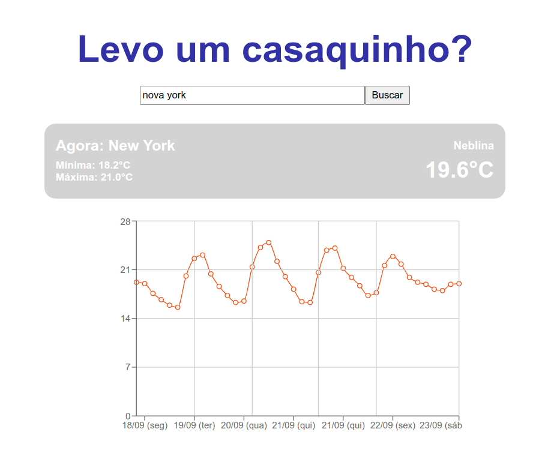

## Description
Technical-Challenge is a simple webpage where, from the name of a city, current temperature, maximum, minimum, and the forecast for the next few days are displayed.



## Technologies Used

<p>


</p>

## Web Acess

You can access and use the app without installation from the link below.
```
https://technical-challenge-blue.vercel.app/
```

## How to run for development

1. Clone the Repository: Clone this repository to your local machine.
```
git clone https://github.com/Eduardo-JP-Ferreira/Technical-Challenge.git
```

2. Install Dependencies: Navigate to the project directory and install the required dependencies.

```
cd Technical-Challenge
npm install
```
3. Populate `.env` file based on `.env.example`. `VITE_REACT_APP_WEATHER_API_KEY` should be your personal key at https://openweathermap.org/

4. Run the Application: Start the development server to run the React application.

```
npm run dev
or 
npm start 
```
